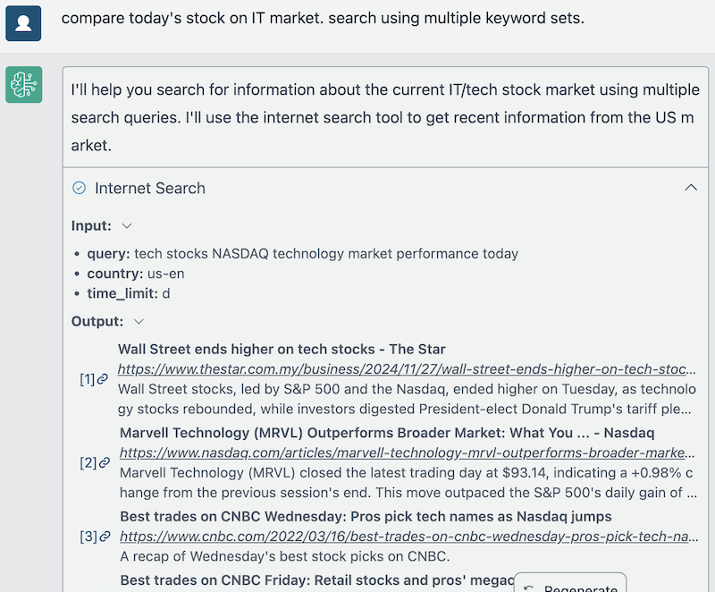

# LLM-drevet Agent (ReAct)

## Hva er Agenten (ReAct)?

En Agent er et avansert AI-system som bruker store språkmodeller (LLM-er) som sin sentrale beregningsmotoren. Den kombinerer resonnementsfunksjonene til LLM-er med ekstra funksjonaliteter som planlegging og verktøybruk for å utføre komplekse oppgaver autonomt. Agenter kan dele ned kompliserte spørsmål, generere trinnvise løsninger og samhandle med eksterne verktøy eller API-er for å samle informasjon eller utføre deloppgaver.

Denne eksempelet implementerer en Agent ved bruk av [ReAct (Reasoning + Acting)](https://www.promptingguide.ai/techniques/react) tilnærmingen. ReAct gjør det mulig for agenten å løse komplekse oppgaver ved å kombinere resonnement og handlinger i en iterativ tilbakemeldingssløyfe. Agenten går gjentatte ganger gjennom tre nøkkeltrinn: Tanke, Handling og Observasjon. Den analyserer den nåværende situasjonen ved hjelp av LLM-en, bestemmer neste handling som skal utføres, gjennomfører handlingen ved bruk av tilgjengelige verktøy eller API-er, og lærer av de observerte resultatene. Denne kontinuerlige prosessen gjør at agenten kan tilpasse seg dynamiske omgivelser, forbedre nøyaktigheten ved oppgaveløsning og levere kontekstbevisste løsninger.

## Eksempelbrukstilfelle

En Agent som bruker ReAct kan benyttes i ulike scenarioer, og gir nøyaktige og effektive løsninger.

### Tekst-til-SQL

En bruker spør etter "det totale salget for siste kvartal." Agenten tolker denne forespørselen, konverterer den til en SQL-spørring, kjører den mot databasen og presenterer resultatene.

### Finansiell prognose

En finansanalytiker trenger å lage en prognose for neste kvartals inntekter. Agenten samler relevante data, utfører nødvendige beregninger ved bruk av finansielle modeller og genererer en detaljert prognose, som sikrer nøyaktigheten av prosjeksjonene.

## Slik bruker du Agent-funksjonen

For å aktivere Agent-funksjonaliteten for din tilpassede chatbot, følg disse trinnene:

1. Naviger til Agent-seksjonen i den egendefinerte bot-skjermen.

2. I Agent-seksjonen vil du finne en liste over tilgjengelige verktøy som kan brukes av Agenten. Som standard er alle verktøy deaktivert.

3. For å aktivere et verktøy, slår du ganske enkelt på bryteren ved siden av det ønskede verktøyet. Når et verktøy er aktivert, vil Agenten ha tilgang til det og kan benytte det ved behandling av brukerforespørsler.

> [!Viktig]
> Det er viktig å merke seg at aktivering av et hvilket som helst verktøy i Agent-seksjonen automatisk vil behandle ["Kunnskap"-funksjonaliteten](https://aws.amazon.com/what-is/retrieval-augmented-generation/) som et verktøy også. Dette betyr at LLM-en selvstendig vil avgjøre om den skal bruke "Kunnskap" for å svare på brukerforespørsler, og betrakte det som ett av de tilgjengelige verktøyene.

4. Som standard er "Internett-søk"-verktøyet tilgjengelig. Dette verktøyet lar Agenten hente informasjon fra internett for å svare på brukerens spørsmål.

Dette verktøyet er avhengig av [DuckDuckGo](https://duckduckgo.com/) som har hastighetsbegrensning. Det er egnet for PoC eller demomål, men hvis du ønsker å bruke det i et produksjonsmiljø, anbefaler vi å bruke et annet søke-API.

5. Du kan utvikle og legge til dine egne egendefinerte verktøy for å utvide Agentens kapasiteter. Se [Hvordan utvikle dine egne verktøy](#how-to-develop-your-own-tools)-seksjonen for mer informasjon om å opprette og integrere egendefinerte verktøy.

## Hvordan utvikle dine egne verktøy

For å utvikle dine egne tilpassede verktøy for Agenten, følg disse retningslinjene:

- Opprett en ny klasse som arver fra `AgentTool`-klassen. Selv om grensesnittet er kompatibelt med LangChain, gir denne eksempelimplementeringen sin egen `AgentTool`-klasse, som du bør arve fra ([kilde](../backend/app/agents/tools/agent_tool.py)).

- Se på eksempelimplementeringen av et [BMI-beregningsverktøy](../examples/agents/tools/bmi/bmi.py). Dette eksempelet viser hvordan du kan opprette et verktøy som beregner kroppsmasseindeksen (BMI) basert på brukerinput.

  - Navnet og beskrivelsen som er erklært på verktøyet, brukes når LLM vurderer hvilket verktøy som skal brukes for å svare på brukerens spørsmål. Med andre ord, de er innebygd i prompten når LLM påkalles. Så det anbefales å beskrive så presist som mulig.

- [Valgfritt] Når du har implementert ditt tilpassede verktøy, anbefales det å verifisere funksjonaliteten ved hjelp av testskriptet ([eksempel](../examples/agents/tools/bmi/test_bmi.py)). Dette skriptet vil hjelpe deg å sikre at verktøyet fungerer som forventet.

- Etter at utviklingen og testingen av ditt tilpassede verktøy er fullført, flytt implementeringsfilen til [backend/app/agents/tools/](../backend/app/agents/tools/)-mappen. Åpern deretter [backend/app/agents/utils.py](../backend/app/agents/utils.py) og rediger `get_available_tools` slik at brukeren kan velge det utviklede verktøyet.

- [Valgfritt] Legg til klare navn og beskrivelser for frontend. Dette trinnet er valgfritt, men hvis du ikke gjør dette trinnet, vil verktøyets navn og beskrivelse som er erklært i ditt verktøy bli brukt. De er for LLM, ikke for brukeren, så det anbefales å legge til en dedikert forklaring for bedre brukeropplevelse.

  - Rediger i18n-filer. Åpne [en/index.ts](../frontend/src/i18n/en/index.ts) og legg til ditt eget `name` og `description` på `agent.tools`.
  - Rediger også `xx/index.ts`. Hvor `xx` representerer landkoden du ønsker.

- Kjør `npx cdk deploy` for å distribuere endringene dine. Dette vil gjøre ditt tilpassede verktøy tilgjengelig på skjermen for tilpasset bot.

## Bidrag

**Bidrag til verktøylageret er velkomne!** Hvis du har utviklet et nyttig og godt implementert verktøy, kan du vurdere å bidra med det til prosjektet ved å sende inn en issue eller en pull request.