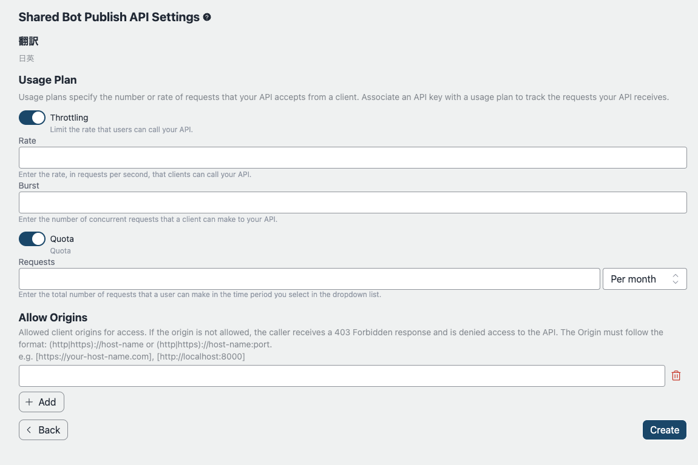

# Penerbitan API

## Gambaran Keseluruhan

Sampel ini termasuk ciri untuk menerbitkan API. Walaupun antara muka sembang boleh menjadi mudah untuk pengesahan awal, pelaksanaan sebenar bergantung kepada kes penggunaan khusus dan pengalaman pengguna (UX) yang dikehendaki untuk pengguna akhir. Dalam beberapa senario, antara muka sembang mungkin menjadi pilihan yang lebih disukai, manakala dalam senario lain, API berasingan mungkin lebih sesuai. Selepas pengesahan awal, sampel ini menyediakan keupayaan untuk menerbitkan bot yang disesuaikan mengikut keperluan projek. Dengan memasukkan tetapan untuk kuota, pengawal aliran, sumber asal, dan sebagainya, titik akhir boleh diterbitkan bersama kunci API, menawarkan fleksibiliti untuk pilihan integrasi yang pelbagai.

## Keselamatan

Menggunakan hanya kunci API tidak disarankan seperti yang diterangkan dalam: [Panduan Pembangun AWS API Gateway](https://docs.aws.amazon.com/apigateway/latest/developerguide/api-gateway-api-usage-plans.html). Oleh itu, sampel ini melaksanakan sekatan alamat IP yang mudah melalui AWS WAF. Peraturan WAF digunakan secara meluas merentasi aplikasi kerana pertimbangan kos, dengan andaian bahawa sumber yang ingin disekat berkemungkinan sama merentasi semua API yang dikeluarkan. **Sila patuh kepada dasar keselamatan organisasi anda untuk pelaksanaan sebenar.** Lihat juga bahagian [Senibina](#architecture).

## Cara Menerbitkan Bot API yang Disesuaikan

### Prasyarat

Atas sebab-sebab tadbir urus, hanya pengguna terhad yang boleh menerbitkan bot. Sebelum menerbitkan, pengguna mesti menjadi ahli kumpulan yang dipanggil `PublishAllowed`, yang boleh disediakan melalui konsol pengurusan > Amazon Cognito User pools atau aws cli. Perhatikan bahawa id kumpulan pengguna boleh dirujuk dengan mengakses CloudFormation > BedrockChatStack > Outputs > `AuthUserPoolIdxxxx`.

### Tetapan Penerbitan API

Selepas log masuk sebagai pengguna `PublishedAllowed` dan membuat bot, pilih `API PublishSettings`. Perhatikan bahawa hanya bot berkongsi yang boleh diterbitkan.

Pada skrin berikutnya, kita boleh mengkonfigurasi beberapa parameter berkaitan dengan pembatasan. Untuk maklumat lanjut, sila lihat: [Membendung permintaan API untuk pengaliran yang lebih baik](https://docs.aws.amazon.com/apigateway/latest/developerguide/api-gateway-request-throttling.html).

Selepas pengebumian, skrin berikut akan muncul di mana anda boleh mendapatkan url titik akhir dan kunci api. Kita juga boleh menambah dan memadamkan kunci api.

## Seni Bina

API diterbitkan mengikut diagram berikut:

WAF digunakan untuk pembatasan alamat IP. Alamat dapat dikonfigurasi dengan menetapkan parameter `publishedApiAllowedIpV4AddressRanges` dan `publishedApiAllowedIpV6AddressRanges` dalam `cdk.json`.

Apabila pengguna mengklik untuk menerbitkan bot, [AWS CodeBuild](https://aws.amazon.com/codebuild/) akan melancarkan tugas pengploian CDK untuk menyediakan tumpukan API (Lihat juga: [Definisi CDK](../cdk/lib/api-publishment-stack.ts)) yang mengandungi API Gateway, Lambda dan SQS. SQS digunakan untuk memisahkan permintaan pengguna dan operasi LLM kerana menjana output mungkin melebihi 30 saat, yang merupakan had kuota API Gateway. Untuk mengambil output, perlu mengakses API secara tidak segerak. Untuk maklumat lanjut, lihat [Spesifikasi API](#api-specification).

Klien perlu menetapkan `x-api-key` pada pengepala permintaan.

## Spesifikasi API

Lihat [di sini](https://aws-samples.github.io/bedrock-claude-chat).